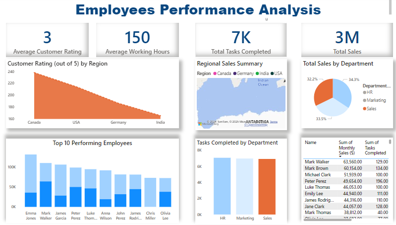

# Employees Performance Analysis Dashboard

This project showcases an **Employee Performance Analysis Dashboard**, built using **Power BI** for data visualization and **SQL** for data extraction and transformation. The dashboard provides a comprehensive analysis of employee performance metrics, including sales, tasks completed, working hours, and customer satisfaction.

---

## Key Insights

### 1. **Overall Performance**
- **Average Customer Rating**: Employees received an average rating of **3 out of 5**.
- **Average Working Hours**: Employees worked an average of **150 hours** per month.
- **Total Tasks Completed**: Employees completed a total of **7,000 tasks**.
- **Total Sales**: The company achieved a total of **$3 million in sales**.

### 2. **Top 10 Performing Employees**
- The bar chart identifies the top 10 employees based on **monthly sales**:
    - **Emma Walker** leads with over **$65,000 in sales**.
    - **Mark Walker** and **James Garcia** also made substantial contributions.

### 3. **Departmental Performance**
- **Sales by Department**:
    - Contributions from the **Sales**, **Marketing**, and **HR departments** were evenly distributed, each contributing approximately **33%** to total sales.
- **Tasks Completed by Department**:
    - The **HR department** completed the most tasks, followed by Marketing and Sales.

### 4. **Regional Insights**
- **Customer Ratings by Region**:
    - Employees in **Canada** received the highest customer ratings, followed by those in the **USA**, **Germany**, and **India**.
- **Regional Sales Summary**:
    - A map visualization highlights sales performance across various regions, providing clear geographic trends.

### 5. **Tasks and Sales Correlation**
- A table combines **monthly sales** and **tasks completed**, showing a direct relationship between productivity and revenue generation.

---

## Dashboard Components

The dashboard was built using the following visualizations:
1. **KPI Cards**:
    - Highlight key metrics like average customer ratings, working hours, tasks completed, and total sales.
2. **Bar Chart**:
    - Displays the **Top 10 Performing Employees** based on monthly sales.
3. **Pie Chart**:
    - Illustrates sales distribution across departments.
4. **Map Visualization**:
    - Shows sales performance by geographic regions.
5. **Area Chart**:
    - Highlights customer ratings by region.
6. **Stacked Bar Chart**:
    - Compares tasks completed across different departments.
7. **Table**:
    - Summarizes employee-level data, including sales and tasks completed.

---

## Tools and Technologies

- **Power BI**: Used for creating the interactive and visually engaging dashboard.
- **SQL**: Utilized to extract, clean, and transform data from the database before loading it into Power BI.

---

## How to Use

1. **SQL Data Preparation**:
    - Write and execute SQL queries to retrieve, filter, and preprocess employee performance data from the database.
    - Ensure that the data is properly structured for Power BI analysis.
2. **Power BI Dashboard**:
    - Import the SQL-extracted data directly into Power BI.
    - Recreate the visualizations using Power BI's drag-and-drop functionality.
    - Use interactive filters and slicers to explore the data and derive insights.
3.  **Dashboard**:
    - 

---

This dashboard provides decision-makers with actionable insights to:
1. Identify top-performing employees for recognition and rewards.
2. Analyze department-wise and region-wise performance trends.
3. Monitor overall KPIs for organizational success.
